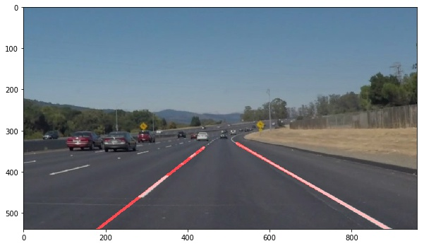

#**Finding Lane Lines on the Road** 

Project report by Mario Tokarz for Udacity Nano Degree Self-driving Car.

Task: Finding Lane Lines on the Road

The goals / steps of this project are the following:
* Make a pipeline that finds lane lines on the road
* Reflect on your work in a written report

In this report I document the pipeline I developed to solve the task. Note that I have prepared a Jupyter Notebook based on the one provided by udacity which is shortened and restructured a bit in order to present my thoughts more clearly.

Find the [Notebook here](../Project 1 - Report.ipynb)

Find the videos of my solution:
* [White lines](../white.mp4)

* [Yellow lines](../yellow.mp4)

* [Extra](../extra.mp4)

---

## Reflection

### The Pipeline 

The pipeline consists of different  steps outlined below.

####1. Conversion to grayscale
First, I converted the images to grayscale.

####2. Apply Gaussian blur
Gaussian Blur is applied as second step

####3. Canny Edge detector
The canny edge detector is applied to the image

####4. Region of interest
* The videos have different resolutions while the camera and with it
    the ratios seem to be the same. I have therefore chosen to use
    factors in combination with the image dimension. I determined the
    factors by rendering the image with a grid.
* Specifically in one video, parts of the car are visible. A simple
    solution is to cut off a small part of the image. This should not
    affect overall detection too much.  In this case, the cut off is
    chosen as 0.05 percent.

In the picture below, you see the chose region of interest as black
overlay. The inverse of this region is removed from the picture as
irrelevant.

This yields the following masked picture to apply the next steps on:

####5. Hough Lines and Draw Lines function

The Hough Transformation is applied to identify lines within the relevant section of the picture.

My basic idea on how to do this is as follows:

1. I cut out all lines with a slope of more/less than 0.4/-0.4 under
the assumption that lane markings need to have a certain minimal slope
as opposed to for exexample horizontal markings on a road.

2. I seperate the individual lines into negative and positive slopes
indicating the left and the right lanemarkings.

3. With left and right seperately, I do the following steps

  1. I use a least square method to fit the lines to a function of
  type m * x + b. This will give me the equation of the function best
  fitting the individual lines I discovered.

  2. For the videos I have added an enhancement here with the
  assumption that lanemarkings are relatively constant over time
  (i.e. the angle of the marking cannot change dramatically during two
  frames). I save the values of the fitted model m, b to a global
  variable and, if the values have been stores, I use a very simple
  exponential smoothing.

  3. Now I use the fitted function with parameters m and b to
  determine where to draw the line, the x values I use are roughly the
  same as those for the region of interest. With these two points
  evaluated for left and right each, I can draw the line that I got
  from my fitted model.

####6. Combination of images

The lines images is combined with the
original image to yiel the result, you can see the result for an
example image in the picture below.

###2. Identify potential shortcomings with your current pipeline

The approach taken here is based on several assumptions which may also be seen as short comings:

* It is based on the assumption that there are actually lane marks, so it may not be robust in scenarios where the lanemarks are missing.

* The smoothing of consequtive frames is based on the assumption that
  the lane markings are continious and also disturbance from
  e.g. shadow does not persist long, so it performs ok on the
  challenge video, but with more difficult conditions this may not
  work sufficiently well.

* The definition of the region of interest is static, potentially in
  broader lanes this might be an issue.

###3. Suggest possible improvements to your pipeline

* The parameters could be more fine tuned, e.g. based on additional examples.

* This approach will only work for streets with continious lane
  markings such as motorways, so it is not an approach for a city, a
  constructions site or others. There would need to be some lane type
  detection.